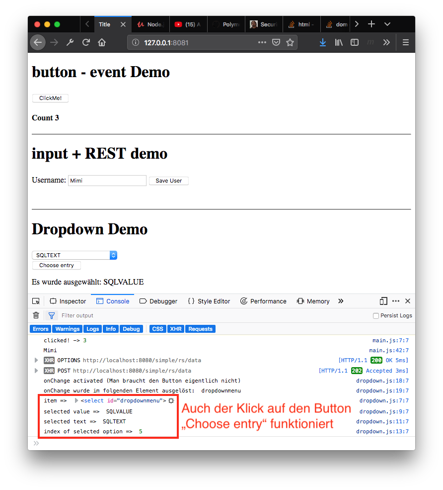

# simple-lit-element-example
Ein einfacher JEE-Server mit RESTful Endpoint und einem LitElement-Client

## Vorbereitung

Zuerst ist der JavaEE-Server im Projekt SimpleServer zu starten (dieser Server braucht KEINE Datenbank).

Es wird der Name in einem Repository gespeichert.

Mittels einem RESTClient kann man die Funktionalität überprüfen:

Zuerst wird ein Name gepostet ...


... und anschließend mit GET wieder abgerufen.


Bei jedem erfolgreichem POST, wird in der Console des Servers der Name ausgegeben.


## Durchführen des Demos

Für das LitElement - Demo öffnet man das Projekt.

```
polymer serve
```

Jetzt kann man die Funktionalität testen. Zuerst ist die HTML-Seite unberührt.


Es werden nicht nur die HTML-Elemente verändert, auch auf der Konsole werden Meldungen ausgegeben.


Hier wurde auch der Button "Choose entry" gedrückt. Man sieht gut, wie man auf die einzelnen Elemente der Dropdown-Box zugreifen kann



### Anmerkung
Man sieht sehr gut wie durch die Verwendung eigener Dateien für die einzelnen Elemente (main.js und dropdown.js) die Komplexität verringert werden kann.

## Deployment

Polymer/LitElement-Projekte können auch auf Nicht-NodeJS-Servern wie bspw Apache httpd deployed werden.

```
polymer build
```

Das so erstellte build-Verzeichnis muss nun auf den jeweiligen Server übertragen werden.

### Sourcecode

index.html

```html
<!DOCTYPE html>
<html lang="en">
<head>
  <meta charset="UTF-8">
  <title>Title</title>
  <link rel="stylesheet" type="text/css" media="screen" href="main.css"/>
</head>
<body>
  <my-app></my-app>
  <my-dropdown></my-dropdown>
  <script type="module" src="main.js"></script>
  <script type="module" src="dropdown.js"></script>
</body>
</html>
```

main.js

```javascript
import {LitElement, html} from "@polymer/lit-element";

class MyApp extends LitElement {
  handleClick() {
    this.count++;
    console.log("clicked! ->", this.count);
  }

  constructor() {
    super();
    this.count = 2;
  }

  static get properties() {
    return {
      count: {type: Number}
    };
  }

  render() {
    return html`
      <h1>button - event Demo</h1>
      <button @click="${() => this.handleClick()}">ClickMe!</button>
      <h4>Count ${this.count}</h4>
      <hr />
      <h1>input + REST demo</h1>
      <div class="username">
        <label for="uname">Username:</label>
        <input type="text" id="uname" name="uname" required
               minlength="4" maxlength="8"
               placeholder="4 to 8 characters long" />
        <span class="validity"></span>
        <button @click="${() => this.postData(this.shadowRoot.querySelector('#uname').value)}">Save User</button>
    </div>
    `
  }

  postData(name) {
    console.log(name);

    // https://stackoverflow.com/a/51854096/9818338
    const userAction = async() => {
      const response = await fetch('http://localhost:8080/simple/rs/data', {
        method: 'POST',
        body: JSON.stringify({name: name}),
        headers:{
          'Content-Type': 'application/json'
        }
      });
      const myJson = await response.json();
    }
    userAction();


    // h<ttps://developer.mozilla.org/en-US/docs/Web/API/Fetch_API/Using_Fetch
    // fetch('http://localhost:8080/simple/rs/data', {
    //   method: 'POST',
    //   mode: 'cors',
    //   cache: 'no-cache',
    //   credentials: 'same-origin',
    //   body: {name: name},
    //   headers: {
    //     'Content-Type': 'application/json'
    //   },
    //   redirect: "follow",
    //   referrer: "no-referrer"
    // })
    //   .then(response => response.json())
    //   .then(res => console.log(JSON.stringify(res)));

  }
}

customElements.define("my-app", MyApp);
```

dropdown.js

```javascript
import {LitElement, html} from "@polymer/lit-element";

class Dropdown extends LitElement {

  handleClick() {
    let selectItem = this.shadowRoot.getElementById('dropdownmenu');
    console.log('item => ', selectItem);
    let currentOptValue = selectItem.value;
    console.log('selected value => ', currentOptValue);
    let currentOptText = selectItem.options[selectItem.selectedIndex].text;
    console.log("selected text => ", currentOptText);
    let currentOptIndex = selectItem.selectedIndex;
    console.log('index of selected option => ', currentOptIndex);
    this.choosenEntry = currentOptValue;
  }

  handleOnChange(e) {
    console.log('onChange activated (Man braucht den Button eigentlich nicht)');
    console.log('onChange wurde im folgenden Element ausgelöst: ', e.target.id);
  }

  constructor() {
    super();
    this.choosenEntry = "nichts ausgewählt";
  }

  static get properties() {
    return {
      choosenEntry: {type: String}
    };
  }

  // https://www.quackit.com/javascript/javascript_dropdown_menu.cfm
  render() {
    return html`
      <br /><br />
      <hr />
      <h1>Dropdown Demo</h1>
      <form name="dropdownform">
      <select id="dropdownmenu" @change="${(e) => this.handleOnChange(e)}">
        <option>Choose ...</option>
        <option value='JavaVALUE' >JavaTEXT</option>
        <option value='JavaScriptVALUE' >JavaScriptTEXT</option>
        <option value='HTMLVALUE' >HTMLTEXT</option>
        <option value='CSSVALUE' >CSSTEXT</option>
        <option value='SQLVALUE' >SQLTEXT</option>
        <option value='Database TutorialVALUE' >Database TutorialTEXT</option>
        <option value='Web Hosting TutorialVALUE' >Web Hosting TutorialTEXT</option>
      </select>
      </form>
      <button @click="${() => this.handleClick()}">Choose entry</button>
      <!--<button @click="${() => this.handleClick(this.shadowRoot.querySelector('#dropdownmenu').value)}">Choose entry</button>-->
      <p>Es wurde ausgewählt: <span name="choosenentry">${this.choosenEntry}</span></p>
    `
  }

}

customElements.define("my-dropdown", Dropdown);
```

## Links

- <https://github.com/LarsDenBakker/lit-html-examples>
- <https://43081j.com/2018/08/future-of-polymer>
- 